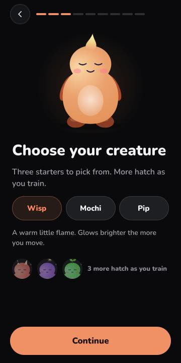
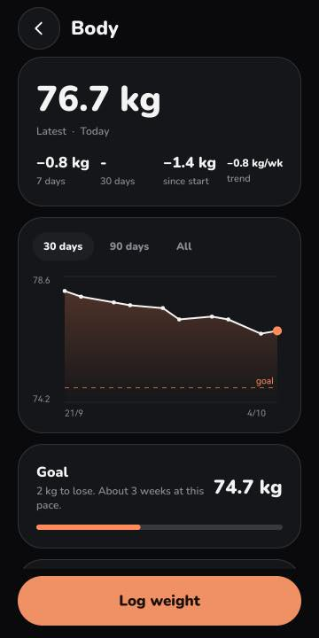
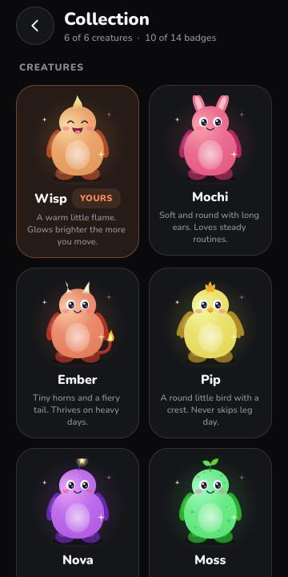

<p align="center">
  
</p>

<h1 align="center">Wisp Gym</h1>

<p align="center">
  A creature that grows from your <b>real</b> training.<br>
  Your phone counts reps from motion alone, tells you when a set is getting too slow, and asks for a rest day when you overdo it.<br>
  <sub>Native ArkTS/ArkUI app for OpenHarmony and HarmonyOS. No account. No cloud. No AI model.</sub>
</p>

<p align="center">
  <a href="https://github.com/BOT-K4CP3R/wisp-gym/actions/workflows/test.yml"></a>
  
  
  
</p>

<p align="center">
  <a href="https://github.com/BOT-K4CP3R/wisp-gym/releases/latest"><b>Download the .hap</b></a> ·
  <a href="https://github.com/BOT-K4CP3R/wisp-gym/releases/latest/download/wisp-gym-demo.mp4">Demo video (2 min)</a> ·
  <a href="docs/ARCHITECTURE.md">Architecture</a> ·
  <a href="AI_WORKFLOW.md">AI workflow</a>
</p>

Built for **HackYeah 2026 / Huawei Challenge "Imagine What's Next"**. Lead area: *Human-Centric Technology*
(wellbeing, responsible design), plus *Spatial Experiences* (sensing body motion). Targets **API 20+** (compiled against API 23).

<p align="center">
  
  
  
  
  
</p>

## What it does

1. **Reps counted automatically.** Carry the phone in a pocket or armband. A streaming detector removes gravity,
   projects motion on the gravity axis (phone orientation does not matter) and counts the drive peaks. Walking and
   sensor glitches are rejected.
2. **Knows when to stop.** It learns your fresh tempo from the first reps. When reps get slower and weaker the ring
   turns orange and Wisp says *"rack it"*, with the numbers behind the advice.
3. **Wisp is your training made visible.** Each muscle group (legs, push, pull, core) grows a body part of the
   creature. Its colour, glow, eyes and mood come from recovery and daily steps.
4. **Rest is part of the game.** Three sessions in 72 h, or a very heavy load, and Wisp asks for a rest day.
5. **Never punishes.** Levels have a floor, there are no streaks to lose, and the creature is never sad: neglect
   makes it *curious*, a fresh session makes it *pumped*, hard training makes it *recharge* or ask for a rest day.
6. **Explainable.** The *Insights* tab lists every value with its source numbers.
7. **Tells you what to do next.** One card on Home picks the next step: your first set, the weakest muscle group,
   a recharge day, a rest day or a bonus set once the weekly goal is met.
8. **A real workout flow.** 3-2-1 countdown, live count, rest timer with −15 s / skip / +15 s and a rest-over alert,
   a safe exit (save / discard / keep training) and a summary that shows what grew.
9. **Friendly first run.** Meet and name your creature, set a gentle weekly goal, permission primers, and a choice
   between real sensors and a clearly labelled demo.
10. **Two home-screen widgets** (2x2 mood mirror, 2x4 with next step, strength, recovery and steps) that open the app.
11. **Six creatures, eleven faces.** Pick a starter (Wisp, Mochi or Pip); Ember, Nova and Moss hatch from
    training badges. Faces follow the moment: focused during a set, straining at the stop cue, proud after it,
    asleep on rest days. A small coach creature reacts live during the workout.
12. **Badges, levels and records.** 14 badges (never taken away), a level from every rep ever counted, and all-time
    personal records.
13. **Loads, body weight and BMI.** Pick the load for each set (remembered per exercise); the summary shows volume
    and new personal records. Log your weight, see 30/90-day/all-time charts, a goal with an ETA at your current pace,
    and BMI with the healthy range for your height. Height, weight and goal are asked during setup (skippable).
14. **Accessible.** Reduce-motion setting (default on emulators that render in software), AA contrast, labelled controls.

Everything is computed and stored **on the phone**. The app requests no network permission.

## Platform capabilities used

| OpenHarmony capability | Used for |
|---|---|
| Accelerometer (SensorServiceKit) | live rep detection and tempo / drive analysis |
| Pedometer (SensorServiceKit, `ACTIVITY_MOTION`) | daily movement for the creature |
| Service widgets (`FormExtensionAbility`, `formProvider`, card Canvas) | 2x2 and 2x4 widgets: creature, mood, next step, strength, recovery, steps |
| Vibrator | stop cue and end-of-rest haptics |
| NotificationKit | "rest over" notification |
| Preferences (`@ohos.data.preferences`) | local, validated persistence |
| Window (`keepScreenOn`, system-bar styling) | the workout screen stays on |
| ArkUI Canvas | procedural creature rendering (6 species, 11 expressions), weight chart |
| Device info (`deviceInfo.abiList`) | Reduce motion by default on software-rendered (x86) emulators |

## Quick start

**Just try it:** download `wisp-gym-debug.hap` from the [latest release](https://github.com/BOT-K4CP3R/wisp-gym/releases/latest)
and install it on an OpenHarmony 6.x emulator or development device:

```bash
hdc install -r wisp-gym-debug.hap
hdc shell aa start -a EntryAbility -b com.hackyeah.wispgym -m entry
```

The package is signed with the SDK's public *development* certificate. On other targets build and sign it yourself (below).

**In the app:** on first launch choose **Explore the demo** (or later: *Settings → Demo mode*, *Load sample history*),
then *Start workout*. Emulators have no real motion, so Demo mode replays a **simulated** accelerometer stream through the same
detector as the real sensor; it is labelled as such in the UI.

## Build from source

Requirements: macOS or Linux, Node.js ≥ 22, JDK 17. **DevEco Studio is not required.**

```bash
./scripts/setup-macos.sh     # one-time: OpenHarmony SDK 6.1 (API 23), hvigor, ohpm (macOS; on Linux use `oniro-app cmdtools install`)
./scripts/test.sh            # 74 unit tests on plain Node, no SDK needed
./scripts/build.sh           # signed debug HAP -> dist/wisp-gym.hap (throw-away development certificate, never committed)
./scripts/emulator-up.sh     # start the Oniro emulator (macOS: brew install qemu), install and launch
python3 scripts/emu-remote.py  # optional: click the emulator from a browser at http://localhost:8765
```

**Emulator tips.** The Oniro launcher starts QEMU without a pointer device, so clicks from a VNC viewer do not reach
the system; `scripts/emu-remote.py` shows the live screen in a browser and turns clicks, drags and the wheel into
touch events over `hdc`. The emulator renders in software: give it RAM (close large browser sessions on an 8 GB Mac)
and restart it if it becomes sluggish. The app turns on *Reduce motion* automatically on x86 emulators.

With DevEco Studio instead: open the folder, *File → Project Structure → Signing Configs → Automatically generate*,
choose a device and press Run. Settings: `compatibleSdkVersion` 20, `compileSdkVersion` 23.

## How it works

```
Accelerometer ──► RepDetector ──► SetAnalyzer ──► WorkoutSession ──► WorkoutRecord ──► LifeEngine ──► Creature + widget
 (SensorKit)       peaks, gravity   tempo + drive     set / rest         (Preferences)    decay, rest      (Canvas / Form)
                   axis, walking    loss -> fatigue   state machine                       guard, reasons
                   rejection        proxy, stop cue
```

`entry/src/main/ets/core` is pure, dependency-free logic that is unit-tested on Node **and** compiled for the device
from the same source files. OS access is isolated in `platform/`. See [docs/ARCHITECTURE.md](docs/ARCHITECTURE.md).

## Verified, and what is not

| Checked | Result |
|---|---|
| Builds and signs with hvigor against SDK 6.1; installs and launches on an OpenHarmony 6.1 emulator | yes |
| Onboarding (creature choice, name, goals, height/weight/goal with BMI, demo and real-sensor paths, replay from Settings), Home, Progress, Insights, Settings, Collection, Body, tab navigation | yes (emulator) |
| Live-counted demo sets with the "rack it" cue, live coach faces, loads, rest controls, multi-set workout, summary with volume, discard confirmation | yes (emulator) |
| Body weight log, chart with goal line, goal ETA, BMI with gauge, weigh-in delete | yes (emulator) |
| Badges, creature unlocks and switching, levels, personal records | yes (emulator) |
| Fallback when the motion sensor is silent (offers Demo mode in place) | yes (emulator) |
| Both widgets added from the launcher, updated after workouts and settings changes | yes (emulator) |
| Tapping a widget opens the app | yes (emulator) |
| System permission dialog for `ACTIVITY_MOTION` with a stated reason (asked once) | yes |
| Unit tests | 74 pass, incl. a 300-set randomised sweep (99.3% exact counts, 100% within ±1 rep) |
| **Real** accelerometer / pedometer / vibration data | **not verifiable** on an emulator; code paths exist and fail gracefully |
| Rep accuracy on real bodies | **not measured**; the sweep above is on synthetic traces |
| HarmonyOS device, DevEco emulator | **not tested** |

First launch on the software-emulated Oniro emulator can take about a minute; it is much faster on hardware-accelerated emulators.
The narrated demo video in the release shows version 1.3 (set counting and the two-week evolution clips come from earlier emulator captures of the same flows).

## Submission checklist (Huawei Challenge, HackYeah 2026)

| Requirement | Where |
|---|---|
| Targets OpenHarmony / HarmonyOS, minimum API 20 | `build-profile.json5` (`compatibleSdkVersion` 20, compiled against 23), runs on the OpenHarmony 6.1 emulator |
| Public source repository, commit history | this repository |
| Reproducible setup, build, install and launch | *Build from source* above, `scripts/` |
| Working `.hap` | GitHub release, or `./scripts/build.sh` → `dist/wisp-gym.hap` |
| Recorded demonstration | release asset `wisp-gym-demo.mp4`, script in `docs/DEMO_SCRIPT.md` |
| Architecture and implementation description | `docs/ARCHITECTURE.md` |
| AI workflow documentation | `AI_WORKFLOW.md` (the product itself contains no AI model) |
| Platform capabilities used | *Platform capabilities used* above |
| Tests | `./scripts/test.sh` (74 Node tests) + hypium suite in `entry/src/test` |
| Third-party material, licences, security | `THIRD_PARTY.md`, `LICENSE`, `SECURITY.md` |

## Project layout

```
entry/src/main/ets/core/        pure logic: RepDetector, SetAnalyzer, WorkoutSession, LifeEngine, Plan, Mood, Profile,
                                Species, Achievements, Body, Store, Sim
entry/src/main/ets/platform/    sensors, pedometer, preferences, haptics, notifications
entry/src/main/ets/ui/          design tokens, components, motion policy, fonts, navigation helpers
entry/src/main/ets/pages/       Index (tab shell), Onboarding, Workout, Summary, Settings, Collection, Body
entry/src/main/ets/views/       Home, Progress, Insights tabs
entry/src/main/ets/widget/      2x2 and 2x4 home-screen cards, shared mini creature
tests/                          Node tests (74) + hypium suite in entry/src/test
scripts/                        setup, build, test, emulator + browser remote, splash/icon rendering
submission/                     scripts that build the demo video and presentation from real emulator captures; promo/ = silent Remotion promo
docs/                           architecture, demo script, UX research, screenshots
```

## Limitations

- Phone-in-pocket sensing suits squats, deadlifts, curls, presses and crunches; bench-type lifts are not supported.
- The fatigue value is a *tempo and drive proxy*, not bar velocity or a medical measurement. The app gives no medical advice.
- Widgets refresh after each workout, when you leave the app and every 30 minutes; they do not animate.
- On the software-rendered emulator the first launch can take a minute and Reduce motion is on by default.

## Documentation

[Architecture](docs/ARCHITECTURE.md) · [Demo script](docs/DEMO_SCRIPT.md) · [UX research](docs/UX_RESEARCH.md) · [AI workflow](AI_WORKFLOW.md) ·
[Third-party notices](THIRD_PARTY.md) · [Security](SECURITY.md)

## AI disclosure

The product contains **no AI model**. The project was built with an AI coding agent (Claude Sonnet 5.5 in Claude Code);
tools, prompts, validation and lessons are documented in [AI_WORKFLOW.md](AI_WORKFLOW.md).

## License

MIT, see [LICENSE](LICENSE). Bundled font: Nunito (SIL OFL 1.1), see [THIRD_PARTY.md](THIRD_PARTY.md).
