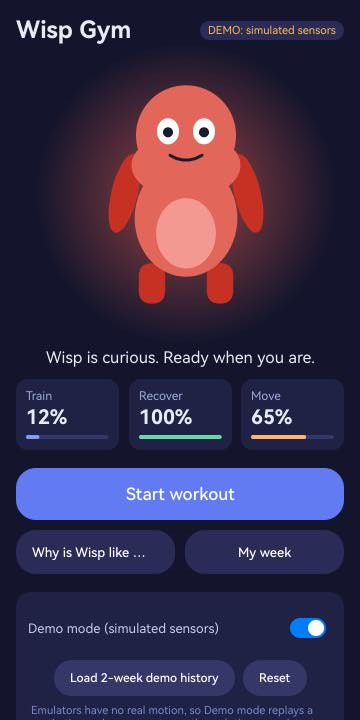
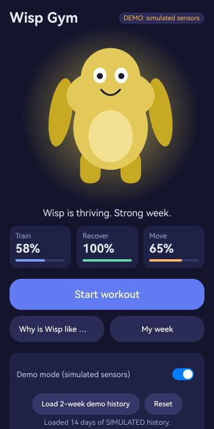
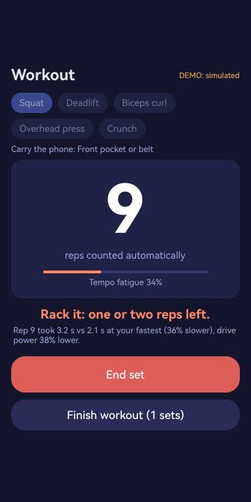
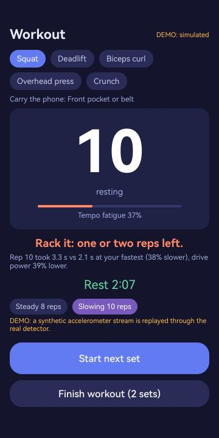
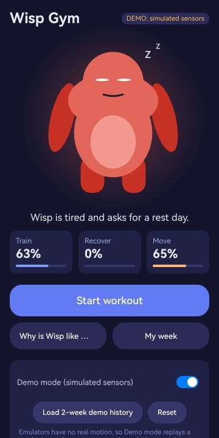
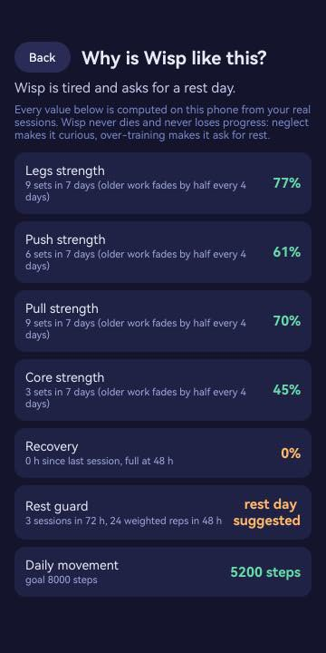
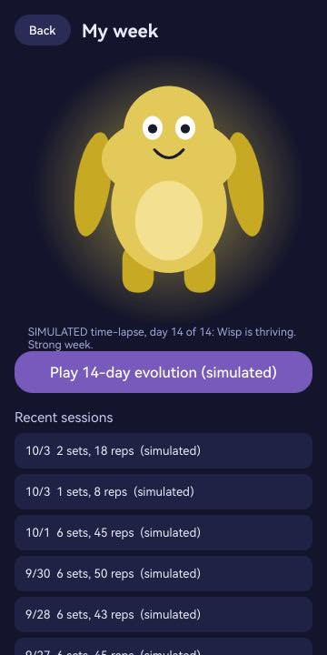
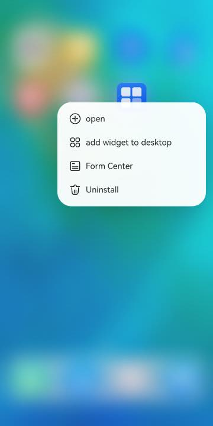
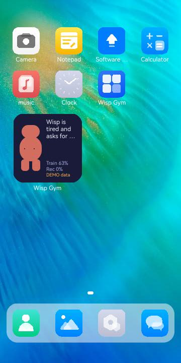

# Wisp Gym

> A small creature that lives on your home screen and grows from your **real** training.
> Your phone counts your reps from motion alone, tells you when a set is getting too slow, and asks for a rest
> day when you overdo it. No accounts, no cloud, no AI model: signal processing and transparent rules.

Built for **HackYeah 2026 / Huawei Challenge "Imagine What's Next"**. Native **ArkTS + ArkUI** for
OpenHarmony / HarmonyOS, **API 20 minimum** (compiled against API 23).

**Challenge areas:** *Human-Centric Technology* (lead: wellbeing, responsible design) + *Spatial Experiences*
(sensing body motion in space). 

## What it does

1. **Reps counted automatically.** Carry the phone in a pocket or armband. A streaming detector removes gravity,
   projects motion on the gravity axis (phone orientation is irrelevant) and counts the drive peaks.
   Walking and sensor glitches are rejected.
2. **Knows when to stop.** From the first reps it learns your fresh tempo and drive. When reps get slower and
   weaker it vibrates and says *"Rack it: one or two reps left"* and shows the numbers behind the advice
   (e.g. "rep 7 took 2.9 s vs 2.0 s at your fastest, 31% slower").
3. **Wisp, the creature, is your training made visible.** Each muscle group (legs, push, pull, core) grows a
   body part of the creature. Its colour, glow, eyes and mood come from recovery and daily steps.
4. **Rest is part of the game.** Three sessions in 72 h or a very heavy load and Wisp asks for a rest day.
5. **Never punishes.** Levels have a floor, there are no streaks to lose, and the creature is never sad: neglect
   makes it *curious*, over-training makes it *sleepy*.
6. **Explainable.** "Why is Wisp like this?" lists every value with its source numbers.
7. **Home-screen widget** (2×2 / 2×4) shows the creature and today's status without opening the app.

Everything is computed and stored **on the phone**. The app requests no network permission.

## Screenshots (OpenHarmony 6.1 emulator, Demo mode)

| Home: curious (no history) | Home: thriving (14-day history) | Stop cue during a slowing set |
|---|---|---|
|  |  |  |

| Rest timer after a fatiguing set | Over-training: Wisp asks for rest | "Why is Wisp like this?" |
|---|---|---|
|  |  |  |

| Simulated 14-day evolution | Add widget (launcher menu) | Widget on the home screen |
|---|---|---|
|  |  |  |

## Platform capabilities used

| OpenHarmony capability | Used for |
|---|---|
| Accelerometer (SensorServiceKit) | live rep detection and tempo/drive analysis |
| Pedometer (SensorServiceKit, `ACTIVITY_MOTION`) | daily movement for the creature |
| Service widget (`FormExtensionAbility`, `formProvider`) | creature + status on the home screen |
| Vibrator | stop cue and end-of-rest haptics |
| NotificationKit | "rest over" notification |
| Preferences (`@ohos.data.preferences`) | local, validated persistence |
| Window `keepScreenOn` | screen stays on during a workout |
| ArkUI Canvas | procedural creature rendering |

## Honest status: what is real and what is simulated

| Part | Status |
|---|---|
| Rep detection, fatigue analysis, creature model, persistence | real code, covered by unit tests on synthetic **and** edge-case traces |
| Accelerometer / pedometer adapters | real SensorServiceKit code; **not verifiable on an emulator** (no physical motion) |
| **Demo mode** | replays a *synthetic* accelerometer stream through the **same** detector as the real sensor; the UI is labelled `DEMO: simulated sensors` everywhere |
| 14-day history and the evolution time-lapse | generated by `core/Sim.ets`, labelled *simulated* |
| Rep-counting accuracy on a real body | not yet measured on real gym recordings (see Limitations) |

## Build, install, launch

Requirements: macOS or Linux, Node.js >= 22, JDK 17. **DevEco Studio is not required.**

```bash
# 1. one-time toolchain (OpenHarmony SDK 6.1 / API 23, hvigor, ohpm, signing helper)
./scripts/setup-macos.sh          # macOS; on Linux use `oniro-app cmdtools install` instead

# 2. unit tests (plain Node, no SDK)
./scripts/test.sh

# 3. signed debug HAP -> dist/wisp-gym.hap  (uses the SDK's built-in development certificate)
./scripts/build.sh

# 4a. emulator: starts the Oniro QEMU emulator (macOS: `brew install qemu`), waits for boot, installs, launches
./scripts/emulator-up.sh

# 4b. or any connected device / emulator
hdc install -r dist/wisp-gym.hap
hdc shell aa start -a EntryAbility -b com.hackyeah.wispgym -m entry
```

With DevEco Studio instead: open this folder, *File → Project Structure → Signing Configs → Automatically
generate*, select a device and press Run. Project settings: `compatibleSdkVersion` 20, `compileSdkVersion` 23.

### Trying it without gym equipment
Open the app, switch **Demo mode** on, tap *Load 2-week demo history*, then *Start workout → Start set*: a
synthetic set is replayed and counted live; the fatiguing scenario triggers the stop cue. *My week → Play
14-day evolution* shows the creature growing over a simulated fortnight.

## Verified on an emulator (what was actually run)

Environment: Oniro/OpenHarmony 6.1 (API 23) x86_64 QEMU emulator, headless, on an Apple-silicon Mac (software
emulation, so it is slow), HAP built with hvigor against SDK 6.1, `compatibleSdkVersion` 20.

| Checked | Result |
|---|---|
| HAP builds and is signed with the SDK development certificate | yes |
| Installs and launches (`bm install`, `aa start`) | yes |
| Home, Workout, Why, Week screens render; navigation works | yes |
| Creature Canvas renders and reacts to history changes | yes (after fixing three issues found on the device, see AI_WORKFLOW.md) |
| Demo set: 8 and 10 reps counted live by the detector, stop cue and explanation, auto-end after a pause, rest timer | yes |
| Over-training: after a third session in 72 h Wisp shows the rest-day state | yes |
| Home-screen widget is offered by the launcher, can be added, shows creature + status | yes |
| System permission dialog for `ACTIVITY_MOTION` with the stated reason | yes |
| Real accelerometer, pedometer, vibration, delivered notification | **not verifiable** on this emulator (no motion hardware); code paths exist and fail gracefully |
| HarmonyOS device / DevEco Studio emulator | **not tested** |
| New launcher icon after reinstall | file verified; the emulator launcher kept its cached icon |

Reproduce the emulator run: `./scripts/build.sh && ./scripts/emulator-up.sh`, then
`DEVICE=127.0.0.1:55557 ./scripts/emu.sh shot <name>` for screenshots.

## Tests

`./scripts/test.sh` runs 22 tests with Node's built-in runner against the **same source files** the app uses
(ArkTS sources are copied to `.test-build` as TypeScript):

- exact rep counts for 3–12 reps and 1.6–3.2 s tempos, any phone tilt; a 300-set randomised sweep over synthetic noise, tilt, slow-down and drive loss (99.3% exact, 100% within ±1 rep; synthetic data, not real recordings)
- zero reps for a phone lying still and for walking; corrupt / duplicate samples ignored
- the fatigue cue fires exactly once for a slowing set and never for a steady one
- creature rules: group growth, decay with a floor, rest request, recovery, future records ignored, never sad
- session state machine and persistence, including corrupt or hostile stored JSON

## Documentation

- [docs/ARCHITECTURE.md](docs/ARCHITECTURE.md): layers, data flow, design decisions
- [AI_WORKFLOW.md](AI_WORKFLOW.md): AI tools used to build this project, prompts, validation, lessons
- [docs/DEMO_SCRIPT.md](docs/DEMO_SCRIPT.md): 90-second demo walkthrough

## Limitations

- Counting accuracy and the fatigue proxy are validated on synthetic traces and edge cases, **not yet on a
  large set of real recordings**. Phone-in-pocket sensing suits squats, deadlifts, curls, presses and crunches;
  bench-type lifts are not supported.
- The fatigue value is a *tempo and drive proxy*, not bar velocity or a medical measurement. The app gives no
  medical advice.
- The widget refreshes periodically and after each workout; it does not animate.
- Emulators do not deliver real motion, vibration or pedometer data.

## License

MIT, see [LICENSE](LICENSE).
